# What are polar lows?
<blockquote>
<em>Polar lows</em> are small (<b>100–500 km</b> in diameter), short-lived maritime depressions with near-surface winds exceeding <b>15 m/s</b>
</blockquote>
- A hazard to ships, oil rigs and coastal communities in the Arctic, North Atlantic and North Pacific
- Typical conditions give an [estimate](http://www.scisnack.com/2015/03/04/polar-lows-what-fuels-arctic-hurricanes/) of roughly $10^{18} J$ of the total <b>kinetic energy</b>.
- Their main energy sources are: air-sea heat fluxes, condensational heating; available potential and kinetic energy of large-scale flow.

  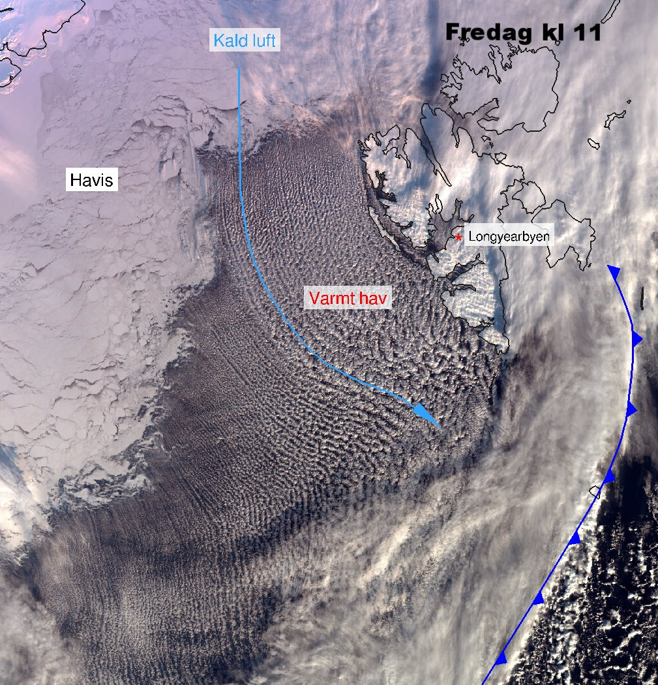
  
<a href="https://twitter.com/Meteorologene">MET Norway</a>

  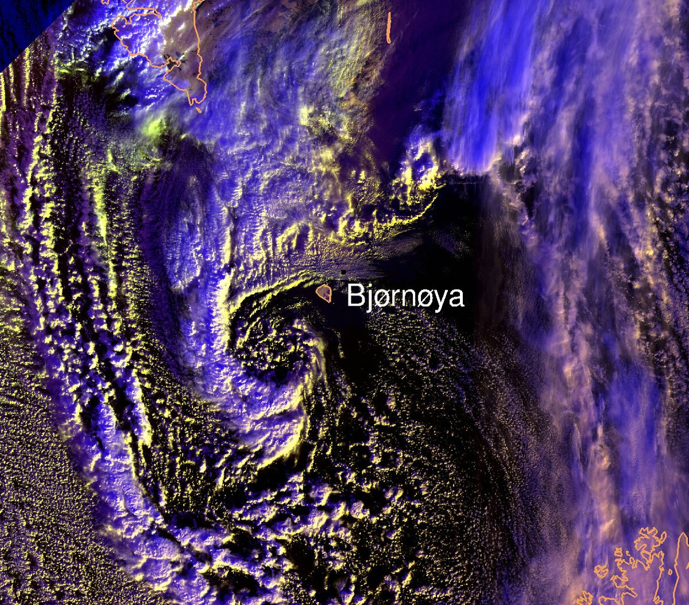
  
<a href="https://twitter.com/Meteorologene">MET Norway</a>

  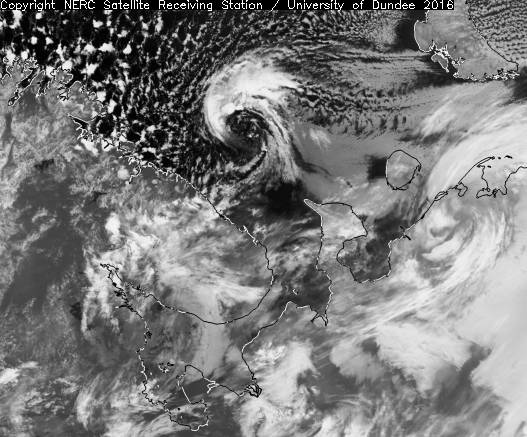
  
<a href="http://www.sat.dundee.ac.uk">NERC Satellite Receiving Station</a>

<aside class="notes">
</aside>

# Where do polar lows occur?
* In the regions of frequent <b>cold-air outbreaks</b>
* Hundreds of polar mesoscale cyclones per year in each region
* More intense polar lows occur less frequently (in the Northern Hemisphere - mostly in winter)

  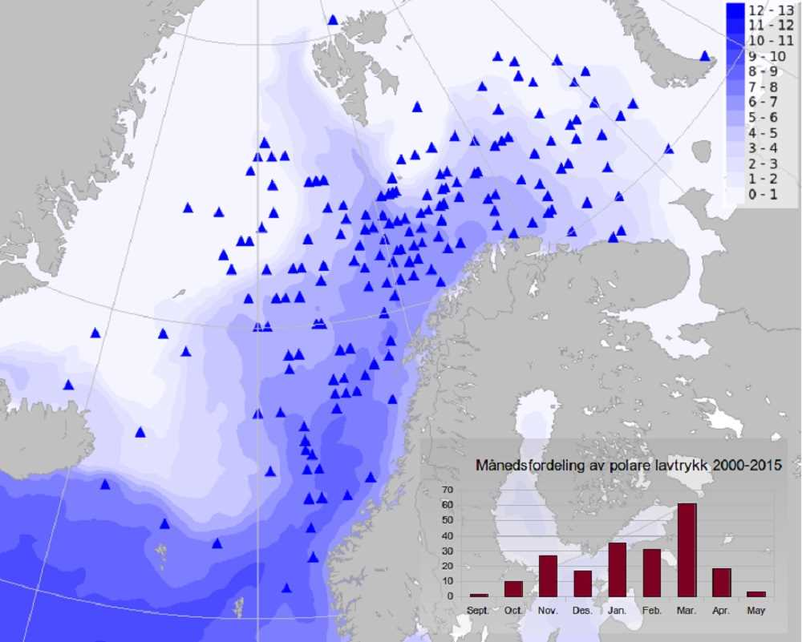
  
Source: MET.no

<aside class="notes">
* There are some favourable locations for the development of polar lows.
* Typically in the regions prone to CAOs, where relatively cold continental air is advected over warm ice-free waters.
* Satellite-based climatological studies show that there are typically hundreds od PMCs per year
</aside>

# "The most beautiful polar low"

  
[Nordeng and Rasmussen, 1992]

  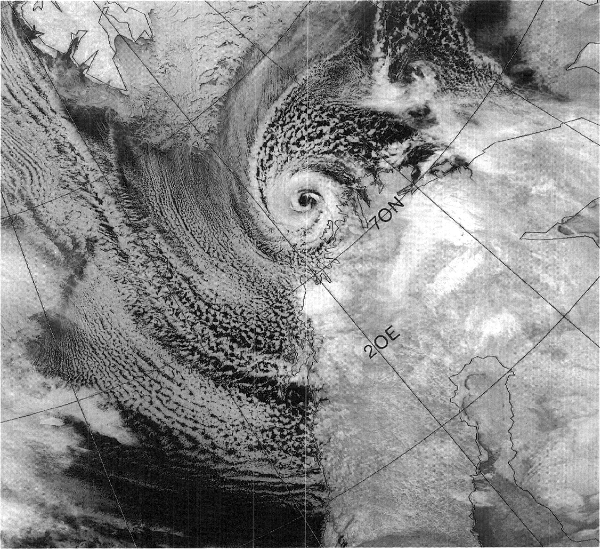

#

  

  <h6 style="font-size:50%;">(not so beautiful)</h6>
  <h3>Example from March 2013</h3>
  
Along the cyclone track:

  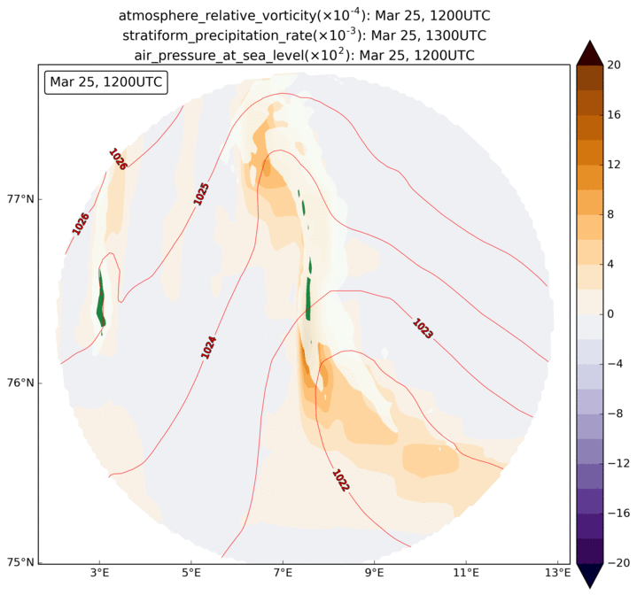
  
vorticity ($10^{-4}$ $s^{-1}$), pressure ($hPa$), precipitation ($g$ $m^{-2}$)

<aside class="notes">
* This slide shows an example of a polar low that developed over the Norwegian Sea in late March 2013
* You can either look at the evolution of the clouds on the right (time goes from top to the bottom row)
* On the left the same PL is shown following the track
* Chains of mesoscale disturbances appeared around the synoptic low, forming the so-called merry-go-round signature
* The northerly flow converged into a line of intense vorticity (brownish colours)
* It was undulating and producing small instability waves
* The vorticity filament bent in half and curled up into a PL
* Later, the PL broke down into a bunch of smaller disturbances
* Its remnants were absorbed by a new stronger PL that formed close to the coast of Norway.
</aside>

# Observations

  <ul>
  <li>Data were gathered instrumented aircraft and dropsondes during ACCACIA field campaign</li>
  </ul>
  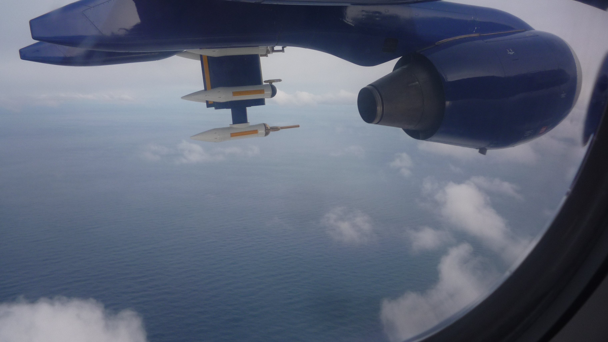
  
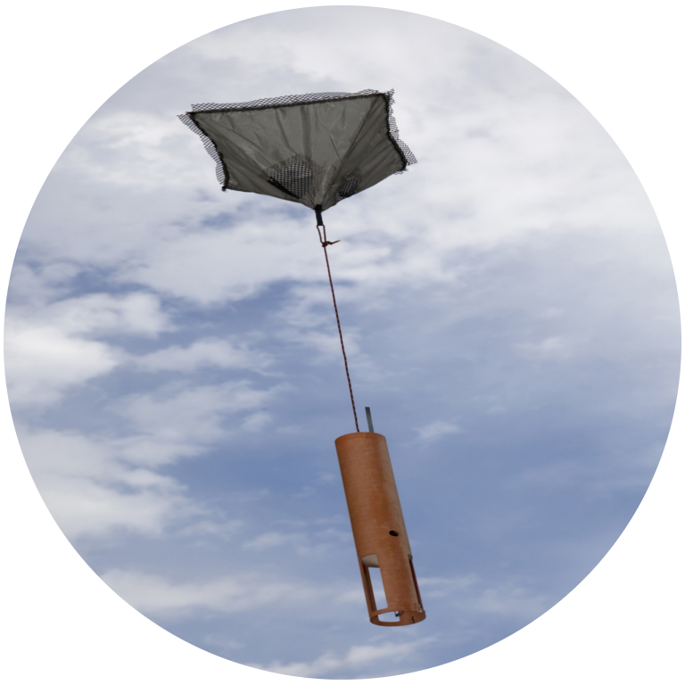

  
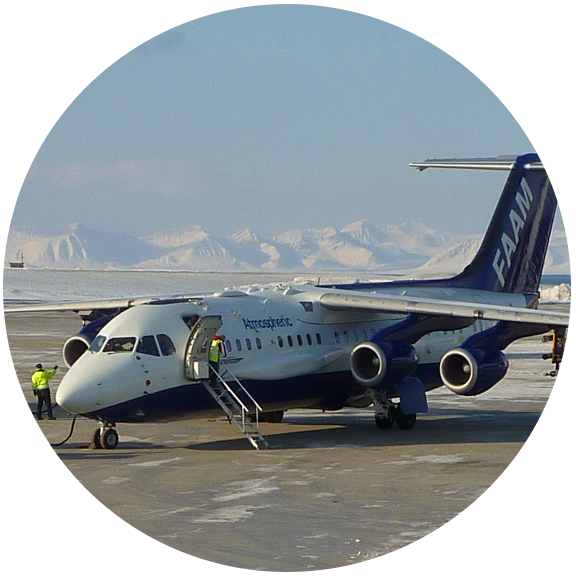

  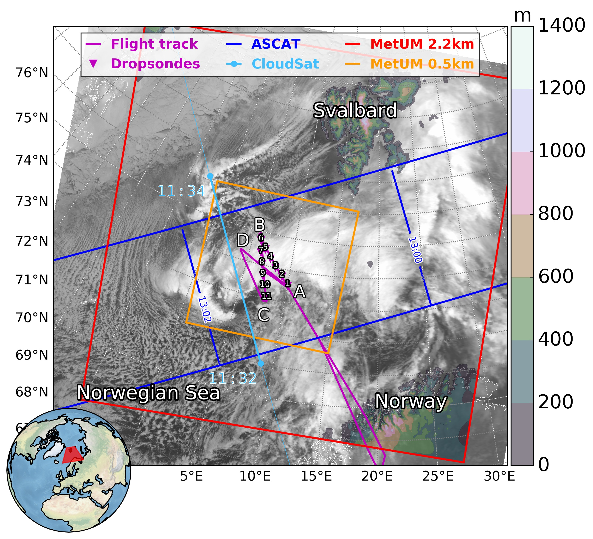
  <ul>
  <li>+ satellite data: AVHRR, CloudSat, ASCAT</li>
  </ul>

<aside class="notes">
* So why is this case worth investigating? 
* Plus, shear-line cases are a bit underrepresented in PL studies. 
* But at the same time this case is typical of many mesoscale vortices forming on the edge of a cold-air outbreak.
* There are a lot of observations available, because it was probed by instrumented aircraft during the ACCACIA field campaign (purple line on the map)
* And it is rare: even today, there are only about a dozen of PLs observed with instrumented aircraft
</aside>

# Flying through the cloud wall

  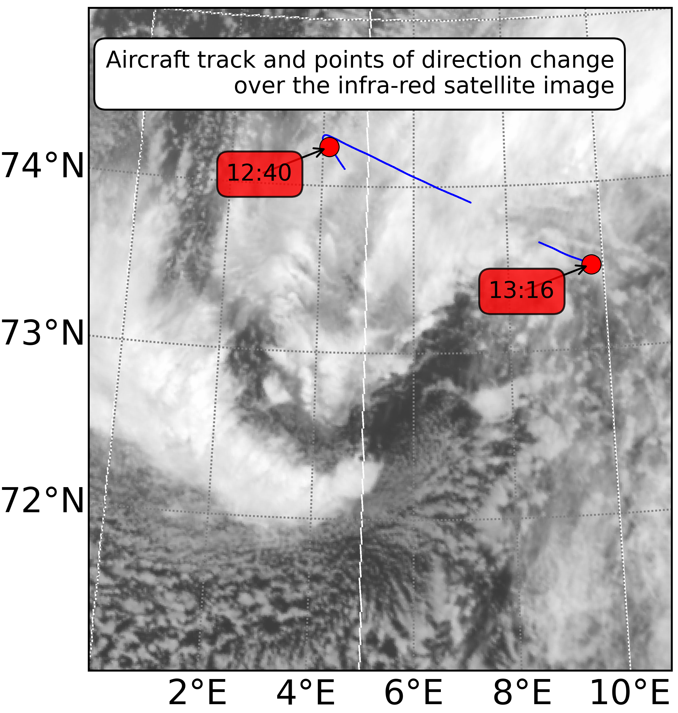

  <video src="media/shear_line_flight.mp4" width="100%" muted controls></video>

<aside class="notes">
* The dramatic change in weather conditions is evident from this video taken by one of the aircraft cameras.
* You can witness the windy and stormy conditions in the cold air mass, but as the aircraft crosses the cloud wall, the atmosphere becomes very calm and clear.
</aside>

# ACCACIA Polar Low: MODIS picture {data-transition="fade-out convex-in"}

  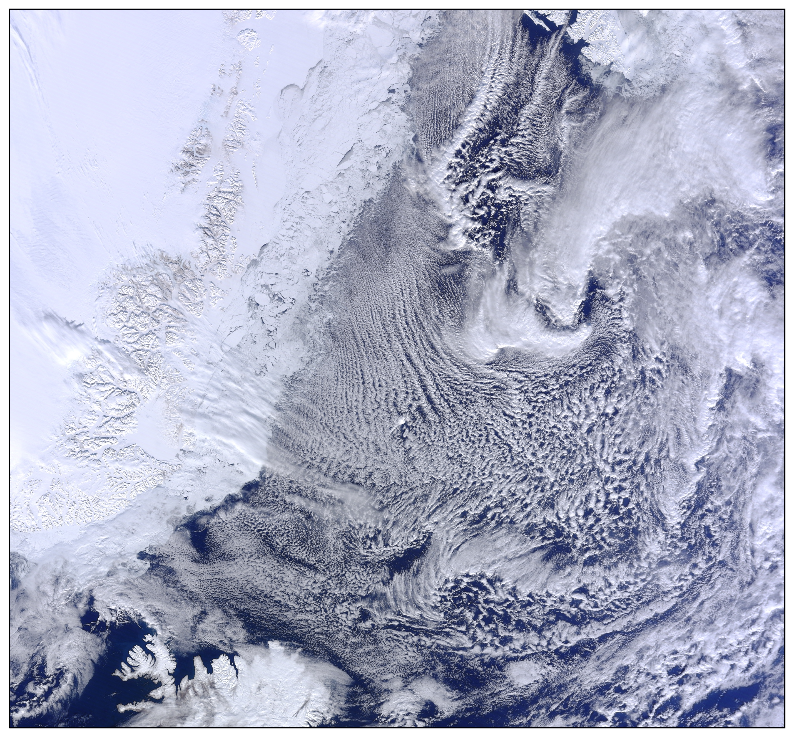
  
NEODAAS NERC Satellite Receiving Station, Dundee University

<aside class="notes">
* Not only we used the aircraft and satellite observations (such as this impressive MODIS RGB image)
* we also ran the Met Office numerical model
</aside>

# Met Office Unified Model simulation {data-transition="fade-in convex-out"}

  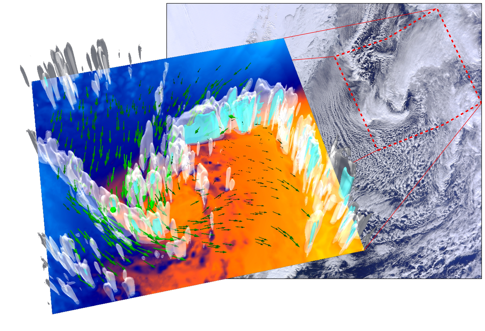

<aside class="notes">
  
The 3D image from the model shows how the polar low is forming on the edge of a CAO

  
Temperature contrast is indicated by blue‐orange colours

  
Following the green vectors of the wind field, you can see the dramatic change in wind speed

  
The model also reproduced the convective clouds (white colours)

</aside>

#
<blockquote>The <b>Met Office Unified Model</b> reproduced the polar low reasonably well</blockquote>

more info in this paper:

<a href="http://onlinelibrary.wiley.com/doi/10.1002/qj.2911/full" class="fragment">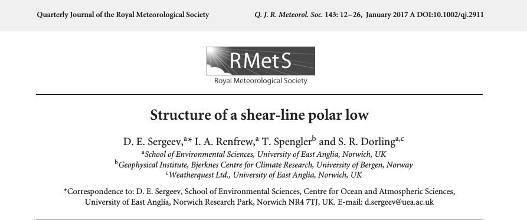</a>
<!--<iframe id="pdfDocument" src="media/paper.pdf" style="width:100%; height: 400px;"></iframe>-->
$$\Downarrow$$

<blockquote>We use it in further analysis of the polar low</blockquote>

#
<h1 style="font-size: 300%; margin: 100px 0 150px 0;">Current research</h1>

# Does geography play a role in polar low formation?

Hypothesis 1:
<blockquote>Svalbard's orography deflects the northerly flow</blockquote>
$$\Downarrow$$
<blockquote>Let's remove Svalbard!</blockquote>

Hypothesis 2:
<blockquote>Several studies indicate that sea ice extent plays a significant role</blockquote>
$$\Downarrow$$
<blockquote>Let's change the sea ice edge!</blockquote>

<h3 style="font-size: 120%">Why is this important?</h3>
* Climate change in the Arctic can lead to a dramatic sea ice retreat
* It is still uncertain how it will affect polar low climatology

<aside class="notes">
* When I looked at the clouds and convergence line in the lee of Svalbard, it seemed that the northerly flow was deflected by Svalbard
* So I decided to change the orography mask in the model and see what happens
* I started with lowering the Svalbard mountains by a certain factor
* Then I got angry and just purged Svalbard from the land mask completely
</aside>

# Experiment without Svalbard

  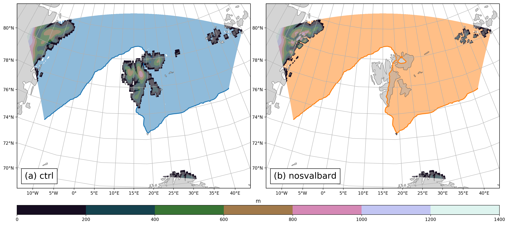

* Surface altitude of Svalbard is set to 0
* Sea ice is the same as in the control (CTRL) run

# without Svalbard
* Removing Svalbard has little impact on the polar low development
* Shown are contours of vorticity ($\zeta>=10^{-3} s^{-1}$) at 950 hPa

  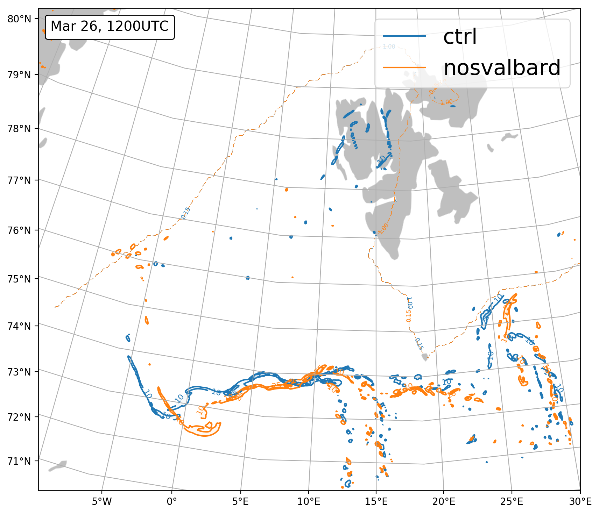

# How is it reflected in the backward trajectories?
* We use LAGRANTO model to calculate trajectories backward in time, starting from the polar low centre
* All the trajectories coloured by pressure value are shown below

  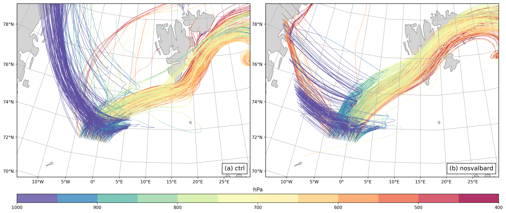

<aside class="notes">

The majority of air parcels that ended up in the PL sector have north and north-west origin

Atmospheric pressure does not change significantly along a single trajectory, implying the mesocyclones formed without interaction with the upper troposphere.

Air from the Svalbard region moves mostly within mid-tropospheric levels

</aside>
# How is it reflected in the backward trajectories?
* Now only the trajectories that ended up in the boundary layer (below 850 hPa)

  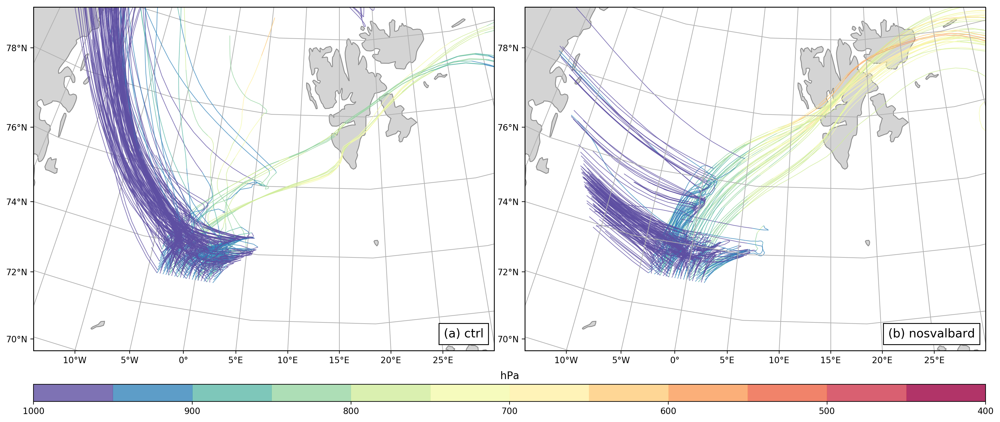

<aside class="notes">

Very few trajectories pass over Svalbard

</aside>

# Experiment with straight sea ice edge

  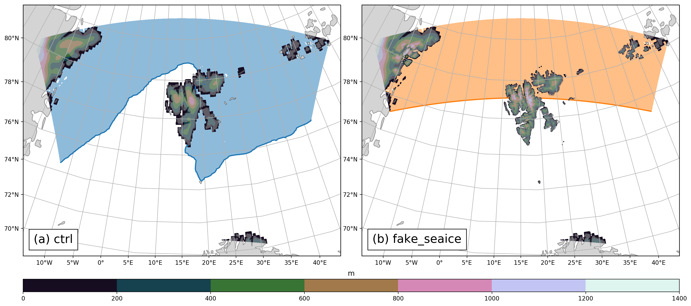

* Surface altitude of Svalbard is the same as in CTRL
* Sea ice edge is a straight line

# with straight sea ice edge
* Perturbing ice cover has bigger impact: the cyclone is displaced more

  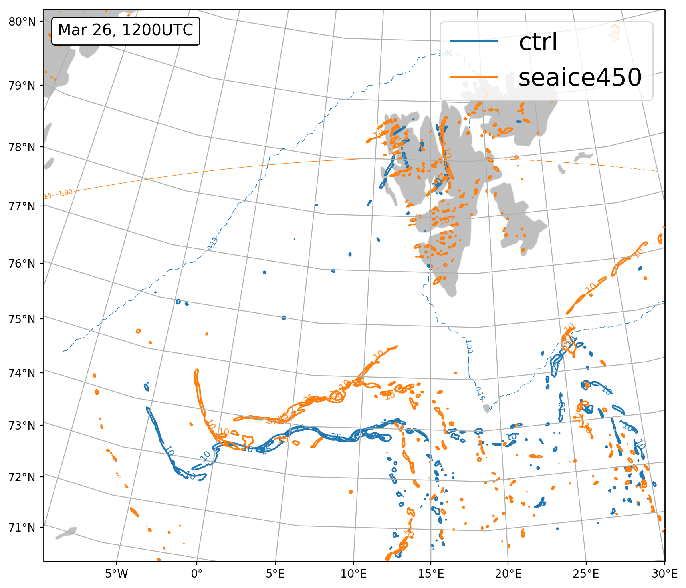

# Don't worry
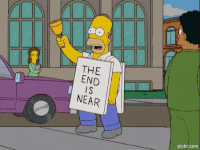

# Experiment without Svalbard AND with straight sea ice edge

  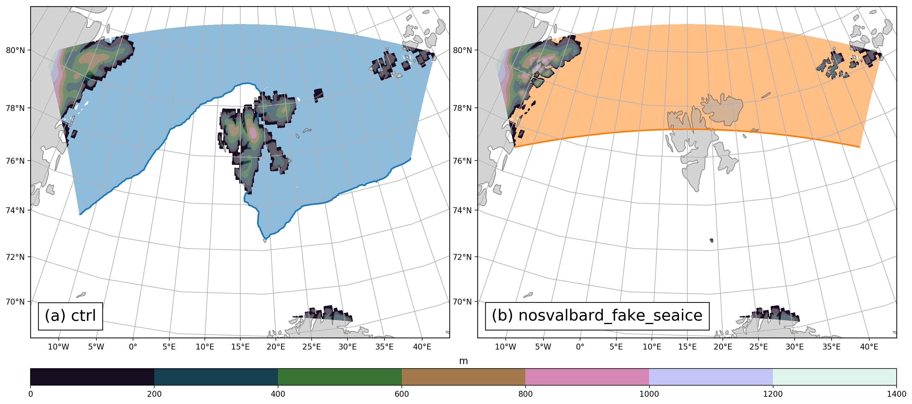

* Surface altitude of Svalbard is set to 0
* Sea ice edge is a straight line

# without Svalbard AND with straight sea ice edge
* 2 factors combined result in the biggest difference compared to CTRL

  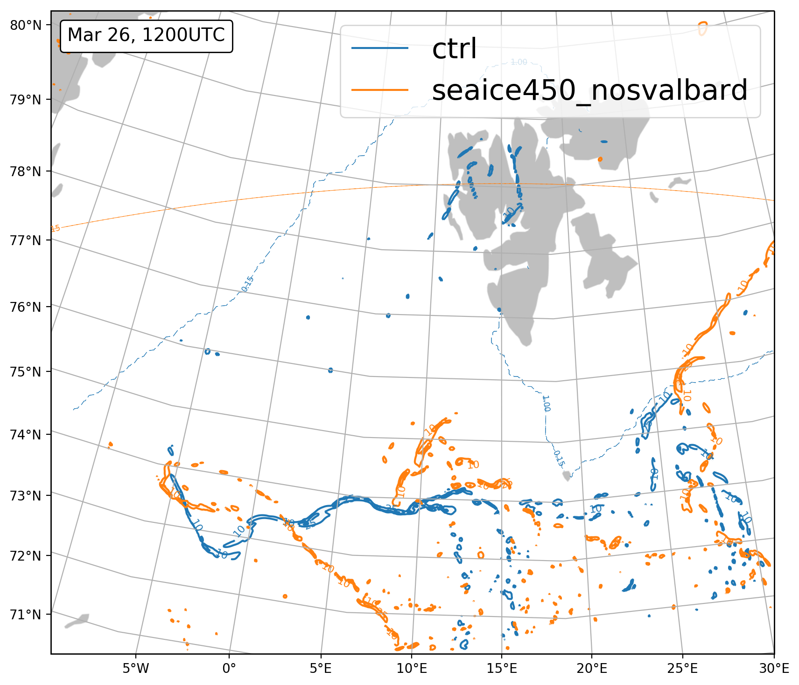

# Summary of sensitivity experiments

  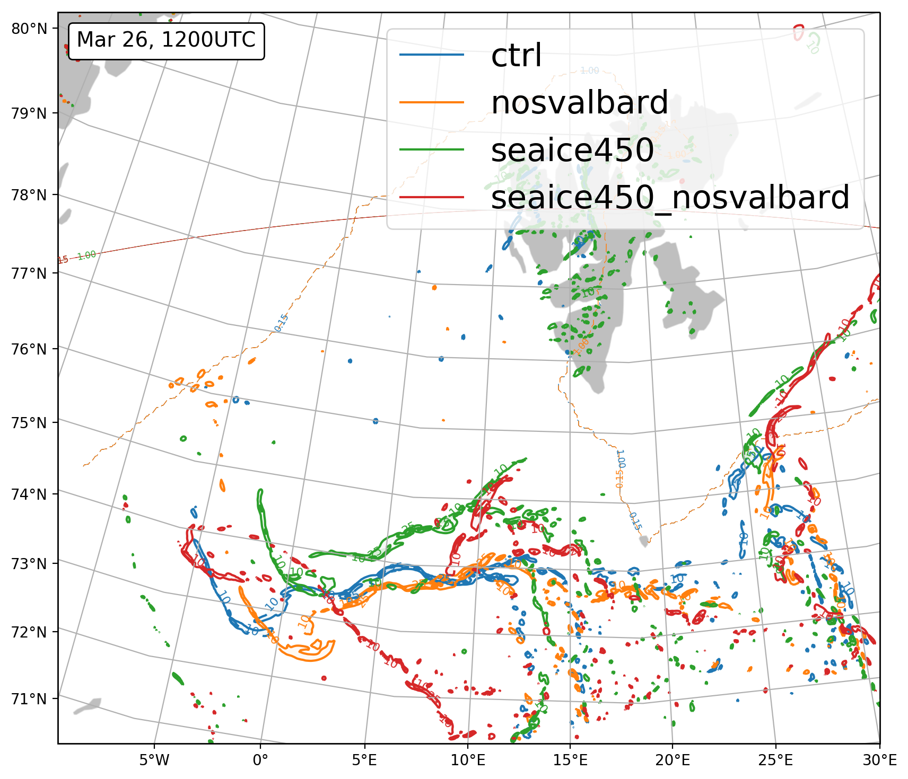

* The existence of the polar low is determined by the atmospheric dynamics
* <em>But</em> the exact location and shape is influenced by surface factors
* Sea ice cover is more important than orography

  

<aside class="notes">
* For a typical "merry-go-round" polar low 
* Real-life polar lows are a mess, but MetUM simulates them well
</aside>

# Future plans
* Run the model for other polar low cases
* Investigate how <em>exactly</em> the sea ice cover affects polar low dynamics

{grid of experiments}

# Thanks!

Questions?

<ul class="icon-list">
  <li><a href="https://twitter.com/meteodenny"><i class="fa fa-twitter -square fa-lg"></i>Twitter: meteodenny</a></li>
  <li><a href="https://https://github.com/dennissergeev"><i class="fa fa-github -square fa-lg"></i>GitHub: dennissergeev</a></li>
  <li><a href="https://dennissergeev.github.io"><i class="fa fa-globe -square fa-lg"></i>Website: dennissergeev.github.io</a></li>
  <li><a href="https://tiny.cc/ceeda-polar-lows"><i class="fa fa-play-circle -square fa-lg"></i>This presentation: tiny.cc/ceeda-polar-lows</a></li>
</ul>
 

 

<!-- bla
<iframe src="media/scene/scene.html" class="stretched" style="height:500px; width:700px"></iframe>-->
