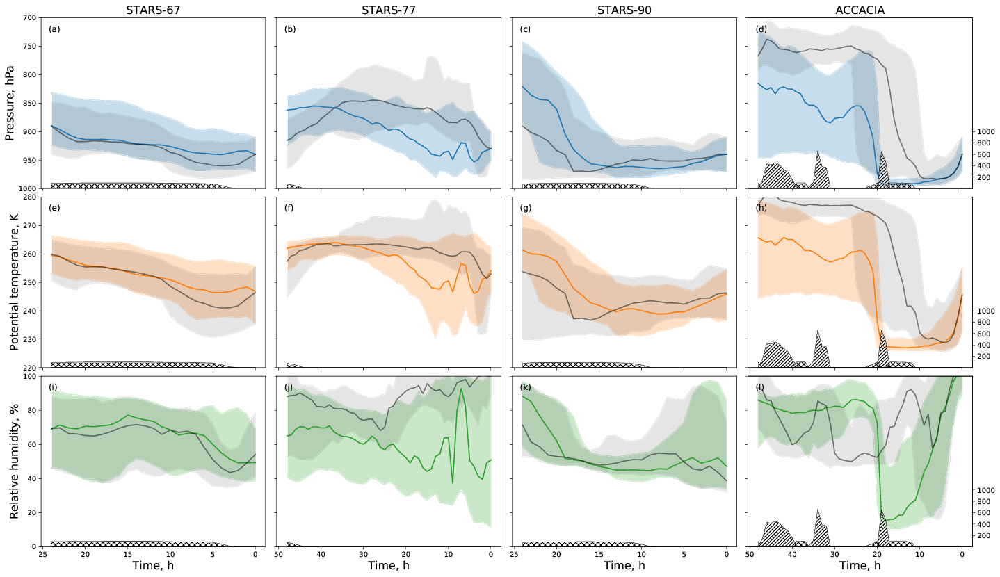

% Arctic Hurricanes and the role of Boundary Layer processes
% Denis Sergeev
% University of East Anglia, 2017

---
## Slide 2

 {{{ left }}}

    

 {{{ right }}}

# Outline

<video src="media/vort-stream-theta.mp4" width="100%" muted controls></video>

# Figure

